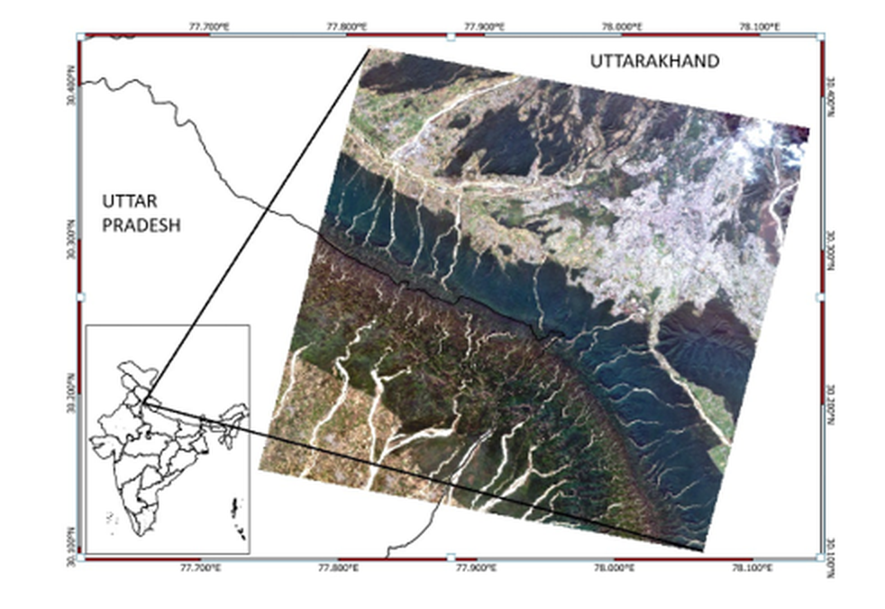
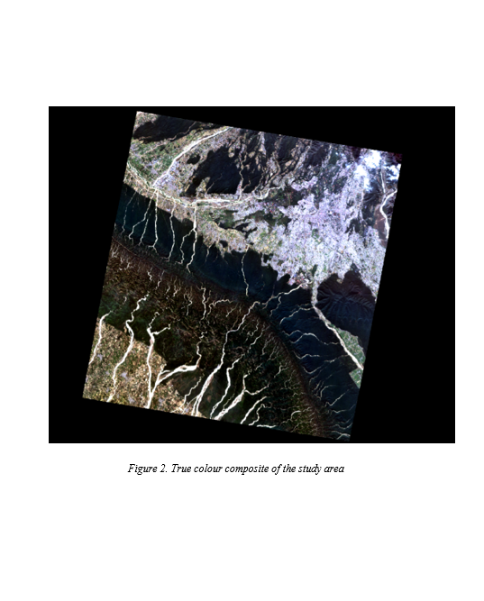
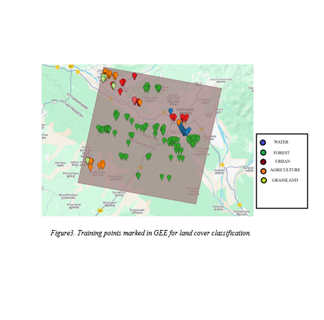
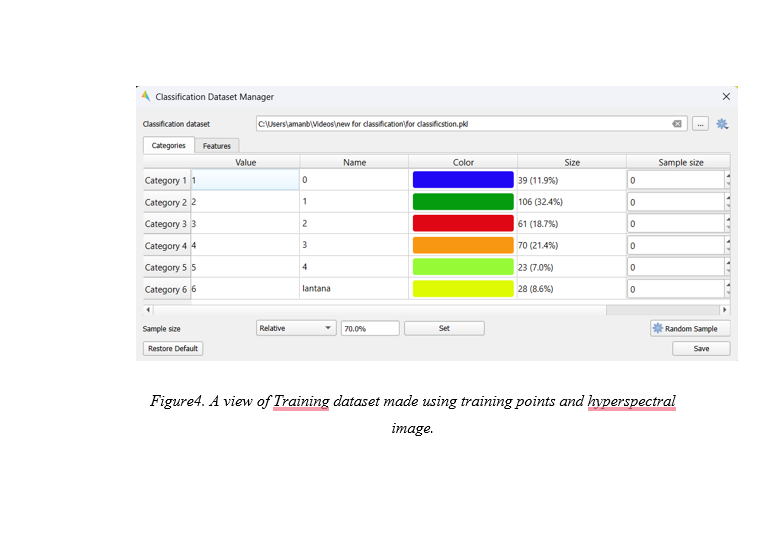
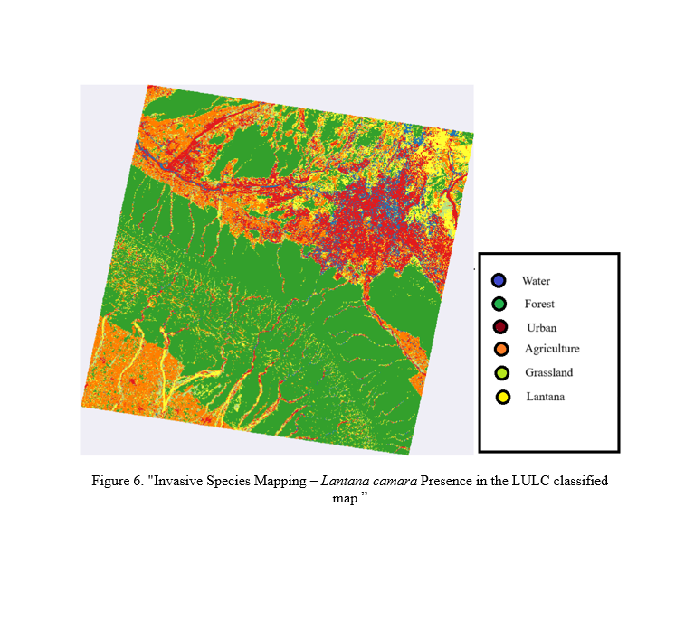

# Mapping Invasive *Lantana camara* with EnMAP Hyperspectral Imagery

This project documents my internship work on mapping the invasive plant species *Lantana camara* in the Dehradun region of Uttarakhand, India, using EnMAP hyperspectral satellite imagery and machine learning.

The workflow combines hyperspectral image processing, Google Earth Engine (GEE) for training-data preparation, QGIS/EnMAP-Box for classification, and a Random Forest (RF) classifier.

## Overview

The study uses EnMAP Level-2A hyperspectral imagery acquired on 11 November 2023. A Random Forest classifier was used to distinguish *Lantana camara* from five other land-cover classes:

- Forest
- Agriculture
- Urban
- Grassland
- Water
- *Lantana camara*

The workflow involved satellite image preparation, training-data generation, supervised classification, and accuracy assessment.

## Study Area

The study focuses on the Dehradun region of Uttarakhand, India, along with the defined surrounding study region.

## Data

### Satellite imagery

- **Mission:** EnMAP
- **Product:** Level-2A
- **Acquisition date:** 11 November 2023
- **Spatial coverage:** approximately 30 km × 30 km
- **Spectral information:** VNIR and SWIR hyperspectral bands
- **Data access:** EOWEB GeoPortal
  

### Training data

Training samples were prepared for six land-cover classes. Candidate training points were initially generated using Google Earth Engine and subsequently reviewed and filtered in QGIS.

The final training dataset contained **327 samples**.

## Methodology

The main workflow consisted of:

1. Acquiring EnMAP Level-2A hyperspectral imagery.
2. Preparing the study area and satellite data.
3. Generating candidate training points using Google Earth Engine.
4. Reviewing and filtering training samples in QGIS.
5. Using field observations for *Lantana camara* samples.
6. Training a Random Forest classifier.
7. Producing the final land-cover classification.
8. Evaluating classification accuracy using reference samples.

## Classification

A Random Forest classifier was used with the following main parameters:

- Number of trees: 100
- Criterion: Gini
- Maximum features: sqrt
- Minimum samples split: 2
- Minimum samples leaf: 1
- Cross-validation folds: 10

## Results

The final classification achieved:

- **Overall accuracy:** 94.47%
- **Correctly classified samples:** 410
- **Reference/validation samples:** 434
- **Training samples:** 327

The classification was performed for six classes, including *Lantana camara*.

## Final Classification Map

The final supervised classification map shows the spatial distribution of the six land-cover classes, including *Lantana camara*, across the study region.

## Tools

- Google Earth Engine
- QGIS
- EnMAP-Box
- Python
- Random Forest

## Acknowledgements

This work was carried out during an internship at the Forest Research Institute (FRI), Dehradun.

Ground observations used for *Lantana camara* were derived from field data provided through the Centre of Excellence for Sustainable Land Management (CoE-SLM) at (FRI) Dehradun.

## Note

This repository documents and organizes the internship work and workflow for portfolio and reproducibility purposes. Large satellite datasets and restricted field-coordinate data are not redistributed here.
